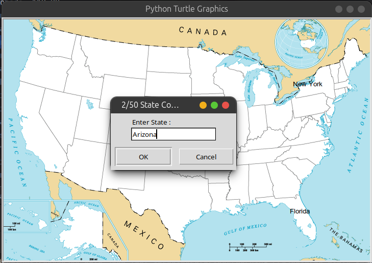

# US State Guessing Game 🗺️🇺🇸
This Python application is an interactive game where players can test their knowledge of US geography by guessing the names of US states. Built with Tkinter, the game displays a map of the United States, and as players correctly guess the states, their names appear in the correct locations on the map.

## Key Features:
- Interactive Gameplay: Type the name of a US state to guess its location on the map.
- Real-Time Feedback: Correct guesses are immediately displayed on the map in their accurate locations.
- User-Friendly Interface: Simple and intuitive UI built with Tkinter, making the game accessible and easy to play.

### Technology Stack:
✅ Python | Tkinter

